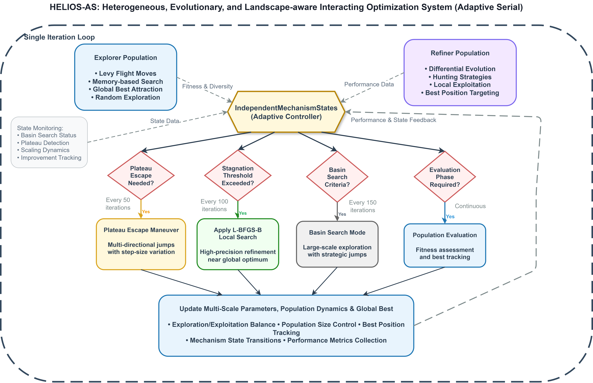
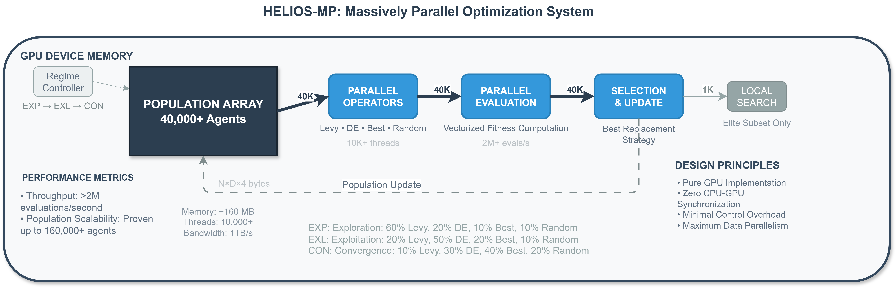

<div align="center">
  
  <h1>HELIOS</h1>
  <p><strong>Heterogeneous, Evolutionary, and Landscape-aware Interacting Optimization System</strong></p>
</div>

Published in *Applications of Evolutionary Computation*, EvoStar 2026, Toulouse, France.
Springer LNCS vol. 16525, pp. 489-503. Nominated for Best Student Paper Award.
Authors recognized as Outstanding Students of EvoStar 2026.

[Read the paper](https://link.springer.com/chapter/10.1007/978-3-032-23607-4_30)

---

This project started as a lunch conversation about why optimizers get stuck. The short
version: most of them pick a strategy and commit to it, which works fine until the
landscape does something unexpected. What if the optimizer could look at what is happening
in real time and switch strategies mid-search?

That question turned into Helios-AS, a landscape-aware serial optimizer with a state
machine that watches fitness metrics live and decides when to escape plateaus, when to
refine precisely, and when to abandon a basin entirely. Then came the harder problem:
how do you run that kind of careful, conditional logic on a GPU with 50,000 agents
that all need to do the same thing at the same time? Per-agent branching kills parallel
throughput, so we could not just port it. We had to translate the intent. That became
Helios-MP.

The result is speedups of 4.7x to 14.2x over the serial version with identical solution
quality. The codebase has both implementations, the full benchmark suite, an ablation
study, and an application to the Lennard-Jones atomic cluster problem.

---

## Results

**Helios-AS vs baselines** (5 functions, 4 dimensions, 5 runs each):

| Algorithm | Overall Mean Fitness | |
|-----------|---------------------|-|
| Helios-AS | **8.21** | statistically tied with CMA-ES (p > 0.05, Mann-Whitney) |
| CMA-ES | 20.4 | |
| COBYLA | 64.7 | |
| Differential Evolution | 80.6 | |
| PSO | 24,500 | |

Helios-AS ties CMA-ES (the gold standard model-based optimizer) and beats everything
else with p < 0.001. At higher dimensions it actually pulls ahead of CMA-ES due to
more robust multimodal handling.

**Helios-MP speedup over Helios-AS (30D, same solution quality):**

| Function | Speedup |
|----------|---------|
| Sphere | 14.2x |
| Rastrigin | 10.9x |
| Griewank | 8.8x |
| Ackley | 6.3x |
| Rosenbrock | 6.2x |
| Levy | 4.7x |

100% success rate preserved across all functions.

**LJ13 atomic cluster problem** (find minimum energy configuration for 13 atoms):

| Algorithm | Best Energy |
|-----------|------------|
| **Helios-AS** | **-40.0040** |
| Simulated Annealing | -39.7171 |
| CMA-ES | -27.7789 |
| Differential Evolution | -7.5517 |
| PSO | -7.2122 |

Lower is better. Helios-AS finds the best configuration of any tested method, including
the tuned SA baseline that is specifically designed for this type of problem.

---

## Architecture

The two implementations look very different by design.



*Helios-AS: a decision-driven optimizer where a central controller reads live search
metrics and triggers the right procedure at the right moment.*



*Helios-MP: a GPU pipeline where 50,000+ agents all operate in device memory, driven
by simple global regimes rather than per-agent state.*

---

## Setup

Python 3.10. CUDA 12.4 only needed for the GPU version.

```bash
git clone https://github.com/your-username/HELIOS.git
cd HELIOS
pip install -r requirements.txt
```

For Helios-MP (GPU):

```bash
pip install cupy-cuda12x==13.4.1
```

If your CUDA version is different, swap `cuda12x` for your version. Run `nvcc --version`
to check. Helios-AS runs entirely on CPU, no CuPy needed.

---

## Quick start

Run everything from the repo root (the folder with `helios_as.py` in it).

**Helios-AS (CPU):**

```python
import numpy as np
from helios_as import HeliosAS, HeliosASConfig

def rastrigin(x):
    return np.sum(x**2 - 10 * np.cos(2 * np.pi * x) + 10, axis=-1)

bounds = np.array([[-5.12, 5.12]] * 30)
optimizer = HeliosAS(rastrigin, bounds, HeliosASConfig(), seed=42)
best_pos, best_fit = optimizer.optimize()
print(f"best: {best_fit:.4e}")
```

The config uses paper defaults out of the box. If you want to tune it:

```python
config = HeliosASConfig(
    num_explorers=40,
    num_refiners=40,
    max_iterations=2000,
    stagnation_threshold=800,
)
```

**Helios-MP (GPU):**

The function has to be written with CuPy so it runs on the device. It receives the
full population as `(population_size, dims)` and returns a `(population_size,)` array:

```python
import numpy as np
import cupy as cp
from helios_mp import HeliosMP, HeliosMPConfig

def rastrigin_gpu(X):
    return cp.sum(X**2 - 10 * cp.cos(2 * cp.pi * X) + 10, axis=1)

bounds = np.array([[-5.12, 5.12]] * 30)
config = HeliosMPConfig(population_size=50000, max_iterations=1000)
optimizer = HeliosMP(rastrigin_gpu, bounds, config)
best_pos, best_fit = optimizer.optimize()
```

Quick rule of thumb: use Helios-AS when your objective is expensive to evaluate (the
surrogate saves you 5x the calls). Use Helios-MP when it is cheap and you want the
fastest wall-clock time.

---

## Reproducing paper results

```bash
# Table I: LJ13 atomic cluster application
python experiments/application_lj13.py

# Table II: ablation study (30D Rastrigin)
python experiments/ablation.py

# Figure 3 and 4: Helios-AS vs Helios-MP convergence and speedup
python experiments/compare_as_vs_mp.py

# Parallel baselines comparison (Helios-MP vs GPU PSO and DE)
python experiments/compare_parallel_baselines.py

# Baseline benchmarks (generates CSVs for Figure 2)
python baselines/bench_helios.py
python baselines/bench_cmaes.py
python baselines/bench_de.py
python baselines/bench_pso.py
python baselines/bench_cobyla.py

# Regenerate Figure 2 from pre-computed data
python analysis/plot_benchmark_results.py
```

Pre-computed results are already in `results/` if you just want to look at the data.

---

## How it works

### Helios-AS

Two populations run in parallel every iteration. Explorers search broadly using Levy
flights, which are random walks with heavy tails, so they occasionally take large jumps
that cover distant parts of the search space. Refiners exploit known good regions using
Differential Evolution, making small perturbations around the current best solutions.
Both share a global best tracker.

The interesting part is the controller, `IndependentMechanismStates`. It watches the
fitness improvement rate, gradient trends, and population diversity in real time. When
something looks wrong, it triggers one of three procedures:

- Stalled for 100+ iterations? Apply L-BFGS-B local search near the global best. This
  is proper gradient-informed descent, much sharper than the population alone.
- Gradient magnitude drops below 1e-9 over 6 recent steps? You are on a flat plateau.
  Fire multi-directional jumps with varying step sizes.
- After 15% of the budget, total progress is less than half the expected range? The
  current basin is not going anywhere. Switch to large-scale random search and find
  a new one.

One thing worth calling out: the surrogate model. Instead of evaluating every candidate
with the real objective, Helios-AS uses a k-NN model trained on evaluation history to
pre-filter bad candidates cheaply. In the ablation study, removing it required 5x more
function evaluations to match the same result. On problems where a single evaluation
takes minutes, that is the difference between practical and impossible.

### Helios-MP

The GPU problem is not speed, it is structure. GPUs run threads in lock-step groups
called warps, so per-agent conditional branching causes idle threads while others wait.
The entire state machine that makes Helios-AS smart is exactly what you cannot do at
scale on a GPU.

So instead of porting the mechanism, we translated the intent of each serial component
into a parallel-friendly analogue:

The state machine becomes a **regime controller**. One global decision per iteration
shifts the entire population between Exploration (60% Levy, 20% DE), Exploitation
(50% DE, 20% best-attraction), and Convergence (40% best-attraction, 20% random). No
per-agent state, no divergence.

The L-BFGS-B local search becomes **Parallel Barzilai-Borwein refinement** on the top
2.5% of agents every 15 iterations. Distributed refinement across many elite candidates
instead of deep refinement on one point.

The escape maneuvers become the **Stagnation Shockwave**. If the global best does not
improve over 50 iterations, 20% of the population gets perturbed by a large random
vector. Global diversity injection, no conditional logic required.

This gets you 4.7 million evaluations per second on an NVIDIA L4 GPU.

---

## Ablation (30D Rastrigin)

| Removed | Mean Fitness | Evaluations |
|---------|-------------|-------------|
| nothing (full system) | **2.40e-05** | **20,352** |
| surrogate model | 4.67e-06 | 99,750 |
| population decay | 6.28e-04 | 16,489 |
| local search | 1.88e-04 | 4,742 |
| escape mechanisms | 2.57e-05 | 16,470 |
| DE operator | 2.75e-03 | 15,492 |
| diversity restart | 2.40e-05 | 20,964 |

Removing the surrogate gives a slightly better final fitness but costs 5x the
evaluations. The full system is optimizing for efficiency under a budget, not
raw accuracy. That is the point.

---

## Citation

```bibtex
@inproceedings{nikhil2026helios,
  author    = {Nikhil Yelahanka Naveen and Abhay Bhandarkar},
  title     = {Helios: A Co-designed Landscape-Aware Optimization System
               Bridging Serial Intelligence and {GPU} Parallelism},
  booktitle = {Applications of Evolutionary Computation},
  editor    = {Garc{\'i}a-S{\'a}nchez, Pablo and D{\'i}az {\'A}lvarez, Josefa and Murphy, Aidan},
  series    = {Lecture Notes in Computer Science},
  volume    = {16525},
  pages     = {489--503},
  publisher = {Springer, Cham},
  year      = {2026},
  doi       = {10.1007/978-3-032-23607-4_30}
}
```

[Springer](https://link.springer.com/chapter/10.1007/978-3-032-23607-4_30) or `paper/HELIOS.pdf`.

---

## License

Apache 2.0. Free to use, modify, and build on with attribution. If you are integrating
this into a commercial product, reach out: nikhilylkn@gmail.com

Experiments ran on: Intel Xeon @ 2.20 GHz, 31 GiB RAM, NVIDIA L4 (22.5 GiB GDDR6),
Ubuntu 22.04.5, CUDA 12.4.
